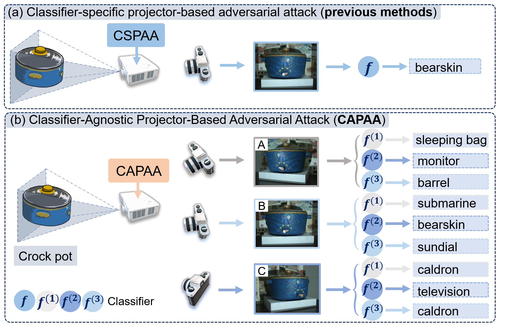

# CAPAA: Classifier-Agnostic Projector-based Adversarial Attacks [IEEE ICME‘25]

<p align="center">
  
</p>

Please watch the [CAPAA Presentation (Link to be added)][8] for a quick introduction of our work.

---
## Introduction

This repository contains the PyTorch implementation for **CAPAA (Classifier-Agnostic Projector-based Adversarial Attacks)**.

For more details, please refer to our [paper][1].

## Prerequisites

* PyTorch compatible GPU (CUDA recommended, e.g., CUDA 11.6, 11.7)
* Conda (Python 3.9 recommended)
* Other Python packages:
    * see [requirements.txt](./requirements.txt).

## Usage

### Reproduce Paper Results

1.  **Set up the Environment:**
    Create a new conda environment:
    ```bash
    conda create --name capaa python=3.9
    # Activate the environment
    conda activate capaa # Linux/macOS
    activate capaa # Windows
    ```

2.  **Clone the Repository:**
    ```bash
    git clone https://github.com/ZhanLiQxQ/CAPAA
    cd CAPAA 
    ```

3.  **Install Dependencies:**
    
    ```bash
    pip install -r requirements.txt
    ```


4. **Download Benchmark Dataset & Pre-trained Models:**
    * Download the CAPAA benchmark [dataset][3] and extract it to the `data/` directory. Refer to [data/README.md](data/README.md) for dataset structure.
    * Ensure the ImageNet label files (`imagenet1000_clsidx_to_labels.txt`, `imagenet10_clsidx_to_labels.txt`) are in the `data/` directory.
    * Download the pre-trained ViT model [vit_base_patch16_224.pth][vit-path] and then place it in `src/python/`.

5. To visualize training progress in real-time, start visdom:
    ```bash
    visdom -port 8083 # Or your preferred port. Don't forget to change the port in 'src/python/utils.py'.
    ```
    Access Visdom in your browser at `http://localhost:8083`.

6. **Configure GPU:**
    Open `src/python/reproduce_capaa_result.py` and set the `CUDA_VISIBLE_DEVICES` environment variable if you need to specify GPUs. For example:
    ```
    os.environ['CUDA_VISIBLE_DEVICES'] = '0' # Use GPU 0
    ```

7. **Run the Reproduction Script:**
    Navigate to the `src/python` directory and execute the script:
    ```bash
    cd src/python
    python reproduce_capaa_result.py
    ```
    This script loads pre-computed attack results and generate summary tables (e.g., `stats_all.xlsx`, `pivot_table_all.xlsx` in `data/setups/`). To re-generate results from scratch, you might need to set `recreate_stats_and_imgs=True` within the script, which can be time-consuming.
    If you want to visualize the training process in **visdom** (slower), you may set `plot_on=True`.
    The results contain the results presented in the main paper and additional results including attacks against ViT-Base-16 as shown in the supplementary materials.
8. **Reproduce supplementary results:**
    
    Some supplementary results can be reproduced by running `reproduce_capaa_result.py` as described above. 
    
    Others can be reproduced by running the following script:
    ```bash
    python classify.py
    ```
    Attack results against 4 unseen classifiers will be saved to `data/setups/`.

---

### Perform Custom Experiments (Data Capture, Real-world Attacks)

1. **Initial Setup:** Complete steps 1-6 from "Reproduce Paper Results."
2. **Core Script:** `src/python/main.py` is designed for cell-by-cell execution (e.g., using PyCharm in **View -> Scientific Mode** or a Jupyter Notebook).
3. **ProCam Configuration & Data Capture (Sections 1-4 in `main.py`):**
    * Define your projector and camera settings in the `setup_info` dictionary within `main.py`.
    * Run the relevant cells to perform synchronization, baseline classification, and capture data for your physical setup. Data is saved under `data/setups/[your_setup_name]/`.
4. **PCNet Training & Attack Generation (Section 5.1 in `main.py`):**
    * Configure `get_attacker_cfg` (e.g., set `load_pretrained=False` for new training, select `attacker_name` (i.e., 'SPAA','CAPAA (classifier-specific)','CAPAA (without attention)' and 'CAPAA').
    * Execute the cell to train your PCNet model (if required) and generate adversarial projector patterns. Patterns are saved to `data/setups/[your_setup_name]/prj/adv/`.
5. **Real-World Attack Execution and Evaluation (Sections 5.2-5.5, 6.x in `main.py`):**
   * Project the generated adversarial patterns onto your physical scene.
   * Capture the results with your camera (saved to `data/setups/[your_setup_name]/cam/raw/adv/`).
   * Run the subsequent cells to summarize the attack effectiveness (success rates, stealthiness metrics).
   * Section 6 allows for evaluating robustness by changing camera poses.
6. **Results:**
   * Results for each setup will be saved in `data/setups/[your_setup_name]/ret/`.
---

## Citation

If you use this dataset or code in your research, please consider citing our work:

```bibtex
@inproceedings{li2025capaa,
  title={CAPAA: Classifier-Agnostic Projector-based Adversarial Attacks},
  author={Li, Zhan and Zhao, Mingyu and Dong, Xin and Ling, Haibin and Huang, Bingyao},
  booktitle={2025 IEEE International Conference on Multimedia and Expo (ICME)},
  year={2025}
}
```

## Acknowledgments

This work builds upon and is inspired by several prior research efforts and open-source implementations. We gratefully acknowledge their contributions:

- This code borrows heavily from:
  - [SPAA][spaa-repo] for **SPAA attacker** and **PCNet architecture** ([models.py](src/python/models.py), [projector_based_attack_cam.py](src/python/projector_based_attack_cam.py)).
  - [CompenNet][5] and [CompenNet++][4] for **PCNet** used in this project ([models.py](src/python/models.py)).
  - [ZhengyuZhao/PerC-Adversarial][7] for the foundational concepts of **SPAA**, and the differentiable **CIE ΔE 2000 metric** ([differential_color_functions.py](src/python/differential_color_functions.py)).
  - [jacobgil/pytorch-grad-cam][cam-repo] for **Grad-CAM** and related visual explanation techniques ([grad_cam.py](src/python/grad_cam.py)).
  - [rwightman/pytorch-image-models][vit-repo] for the **Vision Transformer (ViT)** model implementation ([vit_model.py](src/python/vit_model.py)).
  - [cheind/py-thin-plate-spline][9] for the PyTorch **Thin Plate Spline (TPS)** implementation (`pytorch_tps.py`).
  - [Po-Hsun-Su/pytorch-ssim][10] for the PyTorch implementation of **SSIM loss** ([pytorch_ssim/__init__.py](src/python/pytorch_ssim/__init__.py)).

- We thank the anonymous reviewers for their valuable and inspiring comments and suggestions.
- We thank the authors of any publicly available colorful textured sampling images used during experiments.
- Feel free to open an issue if you have any questions, suggestions, or concerns🥺🥹.

## License

This software is freely available for non-profit non-commercial use, and may be redistributed under the conditions in [license](LICENSE).


[1]: https://arxiv.org/pdf/2506.00978
[3]: https://drive.google.com/file/d/1Kte3lONV2kRgg1hZtRr8ws503jq6JrPU/view?usp=sharing
[8]: # 
[spaa-repo]: https://github.com/BingyaoHuang/SPAA
[4]: https://github.com/BingyaoHuang/CompenNet-plusplus
[5]: https://github.com/BingyaoHuang/CompenNet
[7]: https://github.com/ZhengyuZhao/PerC-Adversarial
[9]: https://github.com/cheind/py-thin-plate-spline
[10]: https://github.com/Po-Hsun-Su/pytorch-ssim
[cam-repo]: https://github.com/jacobgil/pytorch-grad-cam
[vit-repo]: https://github.com/rwightman/pytorch-image-models
[vit-path]: https://drive.google.com/file/d/11H821aPhkHKgeZbUuJGhKsuSLJ5z8u0h/view?usp=sharing
